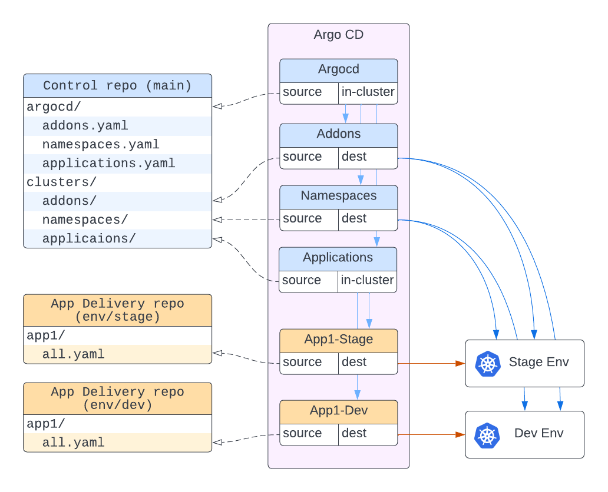

# Example control plane repository

This repository contains Argo CD resources required for deploying [nikita-akuity/demo-workflow](https://github.com/nikita-akuity/demo-workflow) applications among with [Argo Workflows](https://argoproj.github.io/argo-workflows/), [Argo Events](https://argoproj.github.io/argo-events/) and [External Secrets](https://external-secrets.io/).

## Repo structure

The only Argo CD application you need to create manually is "Argocd" with [argocd/](argocd/) source and `in-cluster` destination. Every other application will be created automatically following the GitOps principles.

This is a simplified diagram of what it looks like:

## To add a new application to the existing projects
* Create a source for the application
  * either within an existing delivery repo (e.g. [nikita-akuity/demo-workflow-delivery](https://github.com/nikita-akuity/demo-workflow-delivery))
  * or create a new delivery repo
* Create a PR with
  * Namespaces for the application – in the [clusters/namespaces](clusters/namespaces/) folder
  * ApplicationSet resource – in the [clusters/applications](clusters/applications/) folder

